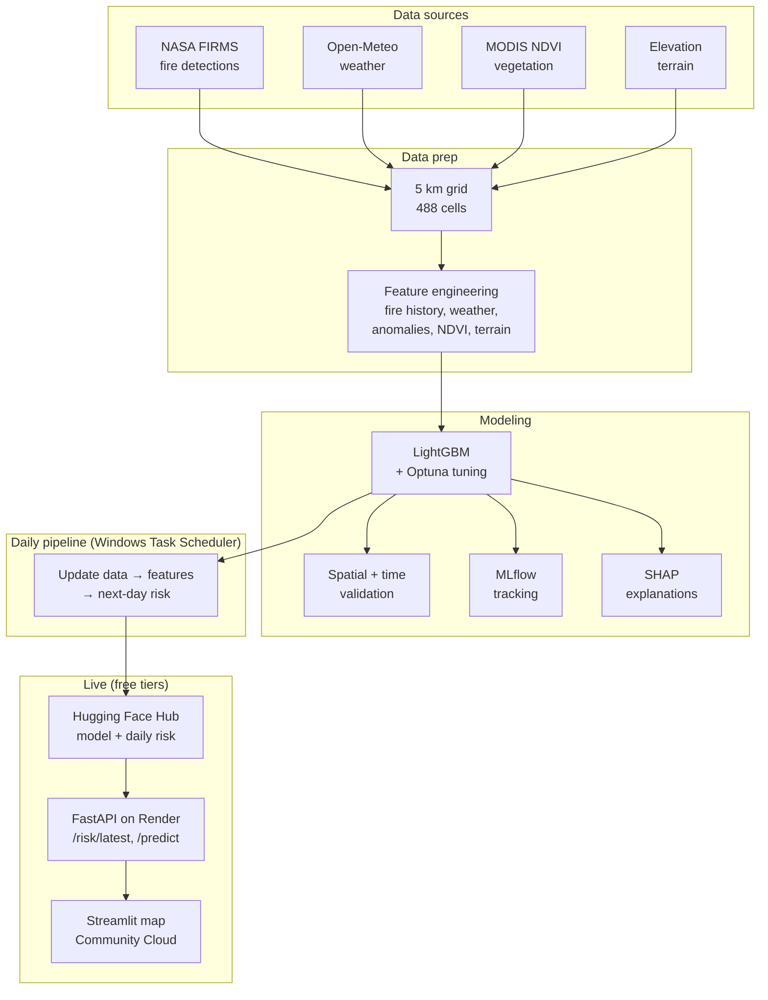

# Architecture

```mermaid
%% draw the groups from top to bottom so the diagram fits the README width
flowchart TB

    %% group 1: the four raw data sources
    subgraph SRC["Data sources"]
        %% lay out the boxes inside this group side by side
        direction LR
        %% NASA satellite fire detections
        FIRMS["NASA FIRMS<br/>fire detections"]
        %% daily weather history and forecast
        METEO["Open-Meteo<br/>weather"]
        %% vegetation greenness from MODIS, gap filled with AppEEARS
        NDVI["MODIS NDVI<br/>vegetation"]
        %% elevation and slope
        DEM["Elevation<br/>terrain"]
    end

    %% group 2: turning raw data into model input
    subgraph PREP["Data prep"]
        %% lay out the boxes inside this group side by side
        direction LR
        %% Lebanon split into ~5 km cells
        GRID["5 km grid<br/>488 cells"]
        %% one row per cell per day with 50+ features
        FEAT["Feature engineering<br/>fire history, weather,<br/>anomalies, NDVI, terrain"]
    end

    %% group 3: training and explaining the model
    subgraph ML["Modeling"]
        %% lay out the boxes inside this group side by side
        direction LR
        %% gradient boosting model, tuned with Optuna
        LGBM["LightGBM<br/>+ Optuna tuning"]
        %% spatial and time validation so the score is honest
        VAL["Spatial + time<br/>validation"]
        %% experiment tracking
        MLF["MLflow<br/>tracking"]
        %% explains why each cell gets its risk
        SHAP["SHAP<br/>explanations"]
    end

    %% group 4: the daily job on the laptop
    subgraph DAILY["Daily pipeline (Windows Task Scheduler)"]
        %% lay out the boxes inside this group side by side
        direction LR
        %% fetch new data, rebuild features, predict tomorrow
        PIPE["Update data → features<br/>→ next-day risk"]
    end

    %% group 5: what runs online
    subgraph CLOUD["Live (free tiers)"]
        %% lay out the boxes inside this group side by side
        direction LR
        %% model and daily predictions stored on Hugging Face
        HUB["Hugging Face Hub<br/>model + daily risk"]
        %% prediction API in Docker on Render
        API["FastAPI on Render<br/>/risk/latest, /predict"]
        %% public interactive map
        MAP["Streamlit map<br/>Community Cloud"]
    end

    %% every data source feeds the grid
    FIRMS --> GRID
    METEO --> GRID
    NDVI --> GRID
    DEM --> GRID
    %% grid becomes the feature table
    GRID --> FEAT
    %% features train the model
    FEAT --> LGBM
    %% model is checked, logged and explained
    LGBM --> VAL
    LGBM --> MLF
    LGBM --> SHAP
    %% the trained model is used by the daily pipeline
    LGBM --> PIPE
    %% the daily pipeline publishes to the Hub
    PIPE --> HUB
    %% the API loads the model and the latest risk from the Hub
    HUB --> API
    %% the map gets all its data from the API
    API --> MAP
```